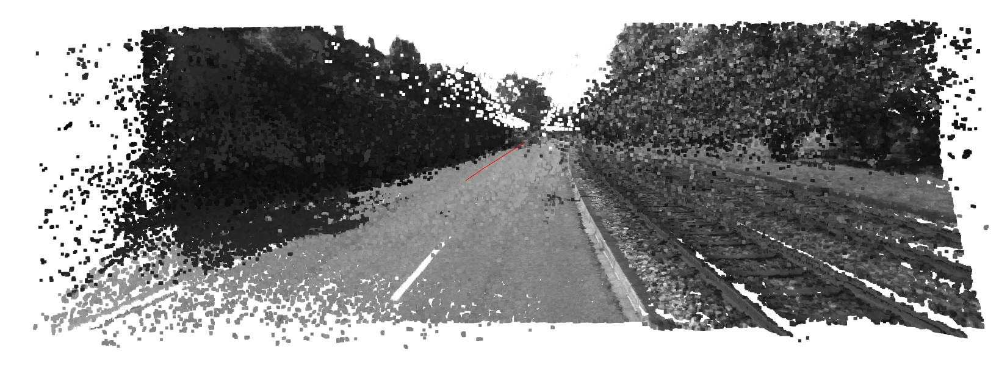
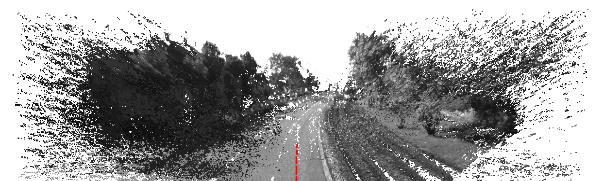

# Stereo-scan Replication

## 1. Overview

This project is a from-scratch Python replication of:

> Andreas Geiger, Julius Ziegler, and Christoph Stiller, **"StereoScan: Dense 3d Reconstruction in Real-time,"** IEEE Intelligent Vehicles Symposium (IV), 2011.

The paper's pipeline takes a stereo video sequence and produces two things: an estimated camera trajectory (visual odometry) and a dense, colored 3D point-cloud reconstruction of the scene. This repo reimplements that pipeline stage by stage - sparse feature matching, egomotion estimation, dense stereo matching, and 3D reconstruction - directly following the paper's section structure, and adds tooling to run and visualize each stage on real KITTI data.

A copy of the paper is included as [Geiger2011IV.pdf](Geiger2011IV.pdf); [mynote_Geiger2011IV.pdf](mynote_Geiger2011IV.pdf) is a personal summary of it.

## 2. How to use the code

Both tools below follow the same pattern: the first run computes results (which can take a while) and caches them to disk; every run after that loads the cache instantly. Both expect a KITTI raw sequence directory (e.g. `2011_09_26_drive_0001_sync/`) in the layout downloaded from the [KITTI raw data page](https://www.cvlibs.net/datasets/kitti/raw_data.php), sitting alongside `config/calib_cam_to_cam.txt`.

### 2.1 Egomotion estimation

Runs sparse feature matching + egomotion estimation (Sec. III-A/B) across the whole sequence and plays back the source video next to the live, growing trajectory estimate, paced to the real capture rate:

```
python -m stereoscan.visualization.live_player 2011_09_26_drive_0001_sync
```

Example output:

https://github.com/user-attachments/assets/7f855c94-364c-4f65-922e-7f906710393e

### 2.2 3D reconstruction + camera trajectory

Runs the full pipeline (Sec. III-A through III-D) - egomotion, dense stereo matching, and greedy multi-frame point fusion - then opens a free-navigation 3D viewer (drag to orbit, scroll to zoom) showing the accumulated colored point cloud with the camera trajectory overlaid. `--end 10` limits the run to the first 10 frames (dense reconstruction is the slow part, ~13-40s/frame):

```
python -m stereoscan.visualization.point_cloud_viewer 2011_09_26_drive_0001_sync --end 10
```

Example output:




## 3. Project structure

Each subfolder of `stereoscan/` corresponds to one part of the paper's pipeline:

| Folder                         | Paper section it replicates                                                                                                                                                       |
| ------------------------------ | --------------------------------------------------------------------------------------------------------------------------------------------------------------------------------- |
| `stereoscan/feature_matching/` | **Sec. III-A, Feature Matching** - blob/corner detection, non-max suppression, the Sobel descriptor, circular (4-image) matching, and Delaunay-based outlier rejection.           |
| `stereoscan/egomotion/`        | **Sec. III-B, Egomotion Estimation** - stereo triangulation, Gauss-Newton reprojection-error minimization, the RANSAC wrapper, and the constant-acceleration Kalman filter.       |
| `stereoscan/stereo_matching/`  | **Sec. III-C, Stereo Matching** - an ELAS-inspired dense disparity estimator (sparse support points setting an adaptive disparity range, then vectorized dense block matching).   |
| `stereoscan/reconstruction/`   | **Sec. III-D, 3d Reconstruction** - the greedy multi-frame point-fusion scheme that builds a persistent, de-duplicated colored point cloud from each frame's dense disparity map. |

Two more folders support running and viewing the above; they don't map to a specific paper section:

| Folder                      | Purpose                                                                                                                                                       |
| --------------------------- | ------------------------------------------------------------------------------------------------------------------------------------------------------------- |
| `stereoscan/pipeline/`      | Orchestration - runs the feature-matching/egomotion or full reconstruction pipeline across an arbitrary dataset directory and frame range, with disk caching. |
| `stereoscan/visualization/` | The interactive tools described in Section 2 above, plus the offline point-cloud renderer used to validate them.                                              |

`tests/` is used during development to test and debug the code as it was built - it holds both a pytest unit-test suite and a set of standalone sanity-check/visualization scripts (one per pipeline stage) whose outputs document each stage's validation.

## 4. Citations

This project replicates:

```bibtex
@inproceedings{Geiger2011IV,
  author = {Andreas Geiger and Julius Ziegler and Christoph Stiller},
  title = {StereoScan: Dense 3D Reconstruction in Real-time},
  booktitle = {Intelligent Vehicles Symposium (IV)},
  year = {2011}
}
```

and is run against the KITTI raw dataset:

```bibtex
@article{Geiger2013IJRR,
  author = {Andreas Geiger and Philip Lenz and Christoph Stiller and Raquel Urtasun},
  title = {Vision meets Robotics: The KITTI Dataset},
  journal = {International Journal of Robotics Research (IJRR)},
  year = {2013}
}
```
